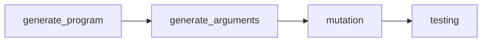

# Automated Testing Engine

<p align="center">
    
</p>


## Background

The _Intelligent Tutoring System_ (ITS) is developed at the _Programming Languages and Software Engineering lab_ at _School of Computing, National University of Singapore_. It  provides automated feedback and grading suggestions for programming assignments. As the architecture and functionality of the ITS expand, there is a need to ensure that the growing code base is maintained at high quality.

## Project Overview

Our team has developed an automated testing engine that uses **black box testing** to identify existing bugs in the [ITS API](https://its.comp.nus.edu.sg/docs#/).

Our solution revolves around **metamorphic testing**, where we develop metamorphic relations around the high level insight of **semantic equivalence**. We modify base Python programs into semantically equivalent ones using [Python AST](https://docs.python.org/3/library/ast.html), then put both the base and modified programs into the ITS API. If it deems them to be semantically unequivalent, it hints at a possible bug.

## Strategy Overview
The main steps of our testing strategy are:
1. Generate a random base Python program.
2. Generate random arguments for the base program.
3. Modify the base program using metamorphic relations to obtain a modified program.
4. Put the base and modified programs into the ITS API, where they act as **test oracles** for one another.



## Project Setup
1. Ensure that you have Python and Docker installed. Otherwise, you can download it [here](https://www.python.org/downloads/) and [here](https://www.docker.com/products/docker-desktop).

2. Clone the repository to a local directory of your preference.
```
git clone https://github.com/cs3213-fse-2024/automated-testing-engine-group-18.git
```

3. In the root directory, create a `.env` file. Inside the file, enter an [OpenAI API key](https://help.openai.com/en/articles/4936850-where-do-i-find-my-openai-api-key). If you do not have a key, you would be unable to use the `OpenAiProgramGenerator` to generate base programs, but you can rely on alternative base program generators instead.
```
CS3213_OPENAI_API_KEY="<YOUR_OPENAI_API_KEY>"
```

4. Run `docker build . -t automated-test-engine` in command prompt to build the Docker image.


5. Run `docker run -v "<current_working_directory>":/app -it --entrypoint /bin/sh automated-test-engine` in command prompt to start the Docker container, and map the current working directory to the `/app` directory in the container.

6. Run `poetry install` to install the required dependencies in the docker container.

7. Run `poetry shell` to activate the virtual environment.

> Note: Replace `<current_working_directory>` with the path to the current working directory.

> Run all the commands from Step 6 onwards in the Docker container.


## Running The Test Engine
The entry point of the application is [`main.py`](its_test_engine/main.py).

We have implemented a total of 13 metamorphic modifiers. Each transforms a base program into a semantically equivalent one in a unique way.


| ID   | Metamorphic Modifier                 | Description                                                                                                                                                      | Constraints for Base Program                                                                                                                                                                                                                                                          |
|------|-------------------------------------|------------------------------------------------------------------------------------------------------------------------------------------------------------------|----------------------------------------------------------------------------------------------------------------------------------------------------------------------------------------------------------------------------------------------------------------------------------------|
| MR01 | `VariableRenamerModifier`           | Function arguments are renamed with new names of the format var_X, such as var_1 and var_2.                                                                      | Function must have at least 1 argument. The function must not have any existing variables of the format var_X.                                                                                                                                                                         |
| MR02 | `BinOpModifier`                     | For + and *, the left and right operands have their orders swapped. - is converted into a + op.                                                                  | Function must have at least 1 arithmetic operation. Can be +, * or -.                                                                                                                                                                                                                  |
| MR03 | `DeMorganModifier`                  | Transforms a 2-variable Boolean expression using De Morgan’s Law.                                                                                                | Function must use 2-variable Boolean expressions, such as in if and while conditions. Each variable should just be a single literal, such as a or b.                                                                                                                                   |
| MR04 | `IdempotentModifier`                | Transforms a 2-variable Boolean expression using Idempotent Law.                                                                                                 | Function must use 2-variable Boolean expressions, such as in if and while conditions. Each variable should just be a single literal, such as a or b.                                                                                                                                   |
| MR05 | `IdentityModifier`                  | Transforms a 2-variable Boolean expression using Identity Law.                                                                                                   | Function must use 2-variable Boolean expressions, such as in if and while conditions. Each variable should just be a single literal, such as a or b.                                                                                                                                   |
| MR06 | `UnravelTernaryModifier`            | Unravels a ternary operator to a standard if-else clause.                                                                                                        | Function must have at least 1 ternary operator. We currently support 3 cases: 1. Ternary operator is used in a return statement. 2. Ternary operator is directly used in an assignment statement. 3. Ternary operator is used as an operand in a binary op of an assignment statement. |
| MR07 | `ForRangeToWhileLoopModifier`       | Transforms a Python for ... in range ... loop to a while loop.                                                                                                   | Function must have at least 1 for ... in range ... loop. range has the syntax of range(start, step, stop). Our modifier modifies it into a while loop if all 3 are numeric values (can be positive or negative)                                                                        |
| MR08 | `ExtraArgumentReassignmentModifier` | For each function argument, it is reassigned to itself multiple times at the start of the function.                                                              | Function must have at least 1 argument.                                                                                                                                                                                                                                                |
| MR09 | `SwapArgumentsModifier`             | Swap argument values internally within a function, and replace argument occurrence accordingly.                                                                  | Function must have at least 2 arguments.                                                                                                                                                                                                                                               |
| MR10 | `WrapInIfTrueBlockModifier`         | Wraps the entire function body into an if True: block                                                                                                            | -                                                                                                                                                                                                                                                                                      |
| MR11 | `WrapInTryBlockModifier`            | For + and *, the left and right operands have their orders swapped. - is converted into a + op.                                                                  | Function body must not throw any exceptions.                                                                                                                                                                                                                                           |
| MR12 | `WrapInExceptBlockModifier`         | Wraps the entire function body into an except block, and places a placeholder try: raise Exception.                                                              | Function body must not throw any exceptions.                                                                                                                                                                                                                                           |
| MR13 | `ReverseListModifier`               | Reverses all lists instantiated within the function. Then, if any of these lists are accessed via indexing, update those indexes to access the correct elements. | Function must contain at least 1 list that is instantiated within the function. For those lists, the function only accesses or updates elements in those lists. No other functionalities are associated with those lists.                                                              |


You can choose which combinations of modifiers to test for, and how many test cases to run. However, we do not recommend combining too many at once, as some modifiers may conflict with one another and having more modifiers takes longer to generate the test cases. 

1. In the methods `run_leetcode_programs()` and `run_open_ai_programs()` of `main.py`, there is a variable called `transformers`. This is a list of modifiers. You can put in any combination of modifiers you want to test for using the 13 modifiers shown above. For `run_open_ai_programs()`, note that you can also specify constraints for `OpenAiProgramGenerator`, to generate base programs that satisfy certain criteria, in order to be applicable for the metamorphic relations that you have chosen.
2. In the block of `if __name__ == "__main__"`, you can choose which base program generator to use, and how many test cases to run for. For example, using `run_leetcode_programs(2)` would run 2 test cases with base programs generated by `LeetCodeProgramGenerator`. For those without an OpenAI API key, you should comment out `run_open_ai_programs(2)` as you do not have access to OpenAI models for base program generation.
3. You can run `python its_test_engine/main.py` from the root directory, while in the docker container, to start generating the test results. Test results reports are generated in the [`test_results`](test_results) folder.


## Test Results and Bug Reports
We have raised a total of 26 bug reports. **20 out of 26** bug reports were accepted as valid bugs. The bug reports can be found in the [`bug_reports`](bug_reports) folder. They reference test results reports which are found in the [`test_results`](test_results) folder.

The bug reports were manually written by us after analysing the output we obtained from the ITS API, while the test results reports are lower-level logs automatically generated as part of our pipeline.

## Running Unit and Integration Tests
We have written unit and integration tests for the automated testing engine, achieving line and branch coverage of 99%.

1. To run the test cases, run `pytest`.

2. To generate a test coverage report, there are 2 options:

```
# Line Coverage
coverage run --source=its_test_engine -m pytest && coverage report --show-missing

# Branch Coverage
coverage run --branch --source=its_test_engine -m pytest && coverage report --show-missing
```

> Run all the commands in the Docker container.


## Acknowledgements
Our team consulted a variety of resources (papers and documentation) to implement the automated testing engine. The attributions can be found in [`Attributions.md`](ATTRIBUTIONS.md).

We would like to extend our appreciation to our project mentor, JIANG Yuancheng, for his invaluable guidance throughout the project. We would also like to thank the ITS API team for assisting us in reviewing the issues and bug reports raised. 😃